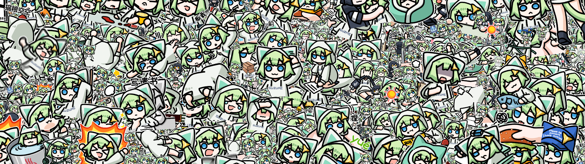

# Suzume 表情包合集

图片来源于 Telegram 的 Suzume 表情包，但是基于 QQ 和微信表情包合集进行了手动整理和重命名

> [!IMPORTANT]
> 由于图片来源并非 QQ 或微信，因此部分表情包有差异，这是正常现象

## 使用方法

所有的表情包都在 `stickers` 文件夹中，其中每个子文件夹的数字名字 `x` 代表了其来自表情包“撕梓咩x”  
子文件夹 `bili` 里放的是 Bilibili 粉丝装扮附带的表情包  
子文件夹 `misc` 里放的是 不属于以上所有合集的其他表情包，图片名字是我根据内容自己写的

你可以直接将本仓库使用 Git 子模块引入到其他的项目里使用：

```sh
git submodule add https://github.com/SamuNatsu/suzume-stickers suzume
```

你也可以冒着被指责为 **滥用 GitHub** 的风险通过直链使用表情包：

```html

```

另外，仓库还包含了一个清单文件 `manifest.json` 用于获取表情包列表，格式如下：

```json
{
  "这是 stickers 文件夹下子文件夹的名字": ["这是该子文件夹下的图片名字列表"]
}
```

示例数据如下：

```json
{
  "1": ["被炉", "吃瓜"],
  "2": ["不许这样"]
}
```

你可以通过这个清单文件来实现搜索，或拼凑出你想要的图片直链

## 帮帮我们！

Telegram 表情包缺失了一些，请帮帮我们！

| 合集 | 名字 | 来源 |
| :--: | :--: | :--: |
|  6   | 墨镜 | 微信 |
|  16  | 捅你 | 微信 |

## 鸣谢

绿色小猫：<https://live.bilibili.com/5208231>  
生成头图所用的生成器：<https://github.com/kermanx/suzume-wallpaper>
